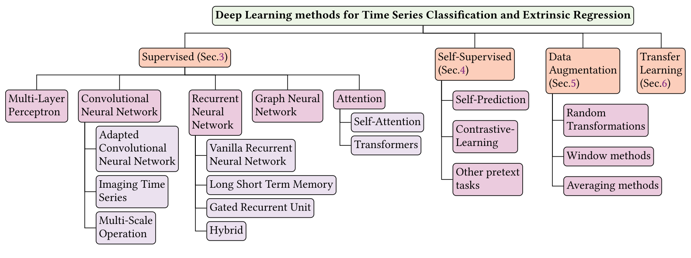

# Time Series Classification and Extrinsic Regression Papers
Deep Learning for Time Series Classification and Extrinsic Regression: A Current Survey

#### ✨ **News:** This work has been accepted for publication in [ACM Computing Survey ](https://dl.acm.org/doi/10.1145/3649448).
## Citation
<p align="center">
    
</p>

If you find **This Survey** useful for your research, please consider citing this paper using the following information:

````
```
@article{Survey24TS,
author = {Foumani, Navid Mohammadi and Miller, Lynn and Tan, Chang Wei and Webb, Geoffrey I. and Forestier, Germain and Salehi, Mahsa},
title = {Deep Learning for Time Series Classification and Extrinsic Regression: A Current Survey},
year = {2024},
publisher = {Association for Computing Machinery},
address = {New York, NY, USA},
issn = {0360-0300},
url = {https://doi.org/10.1145/3649448},
doi = {10.1145/3649448},
note = {Just Accepted},
journal = {ACM Comput. Surv.},
}

```
````


### Summary of CNN models for time series classification and extrinsic regression

|Abbreviation| Title                                                                                 | Venue       | Year | Code |
|------------| --------------------------------------------------------------------------------------| ------------| ---- | ---- |
|MC-DCNN| [Time series classification using multi-channels deep convolutional neural networks](https://link.springer.com/chapter/10.1007/978-3-319-08010-9_33) | WAIM | 2014 | - |
|MC-CNN| [Deep convolutional neural networks on multichannel time series for human activity recognition](https://www.ijcai.org/Proceedings/15/Papers/561.pdf)                                                        | IJCAI | 2015 | - |
|-| [Convolutional neural networks for time series classification](https://ieeexplore.ieee.org/document/7870510)| J. Syst. Eng. Electron | 2017 | - |
|FCN| [Time series classification from scratch with deep neural networks: A strong baseline (FCN, ResNet, Disjoint-CNN)](https://ieeexplore.ieee.org/document/7966039)| IJCNN | 2017 | [code](https://github.com/cauchyturing/UCR_Time_Series_Classification_Deep_Learning_Baseline) |
|Res-CNN| [Integration of residual network and convolutional neural network along with various activation functions and global pooling for time series classification](https://www.sciencedirect.com/science/article/abs/pii/S0925231219311506) | Neurocomputing | 2019 | - |
|DCNNs|[Multivariate Time Series Classification using Dilated Convolutional Neural Network](https://arxiv.org/abs/1905.01697)| arXiv | 2019 | - |
|Disjoint-CNN|[Disjoint-cnn for multivariate time series classification](https://ieeexplore.ieee.org/abstract/document/9679860)|ICDMW|2021|[code](https://github.com/Navidfoumani/Disjoint-CNN)|
|-|[Encoding time series as images for visual inspection and classification using tiled convolutional neural networks](http://coral-lab.umbc.edu/wp-content/uploads/2015/05/10179-43348-1-SM1.pdf) | AAAI | 2015 | - |
|-|[Classification of time-series images using deep convolutional neural networks](https://www.spiedigitallibrary.org/conference-proceedings-of-spie/10696/2309486/Classification-of-time-series-images-using-deep-convolutional-neural-networks/10.1117/12.2309486.short?SSO=1#_=_) |ICMV | 2017 | - |
|-| [Scalable classification of univariate and multivariate time series](https://ieeexplore.ieee.org/abstract/document/8621889) | IEEE Big Data | 2018 | - |
|-| [Classify multivariate time series by deep neural network image classification](https://ieeexplore.ieee.org/document/8901913) | CCHI | 2019 | - |
|RPMCNN| [A deep learning framework for time series classification using relative position matrix and convolutional neural network](https://www.sciencedirect.com/science/article/abs/pii/S0925231219308598) | Neurocomputing | 2019 | - |
|-| [Sensor classification using convolutional neural network by encoding multivariate time series as two-dimensional colored images](https://www.mdpi.com/1424-8220/20/1/168) | Sensors | 2019 | - |
|MCNN| [Multi-scale convolutional neural networks for time series classification](https://arxiv.org/abs/1603.06995)| arXiv | 2016 | - |
|t-LetNet| [Data augmentation for time series classification using convolutional neural networks](https://shs.hal.science/halshs-01357973/document) | AALTD | 2016 | - |
|MVCNN| [Time series classification with multivariate convolutional neural network](https://ieeexplore.ieee.org/document/8437249) | IEEE Trans. Ind. Electron | 2018 | - |
|-| [A cnn adapted to time series for the classification of supernovae](https://www.lirmm.fr/~chaumont/publications/IST_ELECTRONIC_IMAGING_Color_Imaging_2019_BRUNEL_PASQUET_RODRIGUEZ_COMBY_FOUCHEZ_CHAUMONT_Deep_Learning_Supernovae_Ia_vs_Not_Ia.pdf) | Electronic Imaging | 2019 | [code](https://github.com/anthonybrunel/SupernovaeClassification) |
|InceptionTime| [Inceptiontime: Finding alexnet for time series classification](https://link.springer.com/article/10.1007/s10618-020-00710-y) | DMKD | 2020 | [code](https://github.com/hfawaz/InceptionTime) |
|EEG-inception| [Prototypical inception network with cross branch attention for time series classification](https://ieeexplore.ieee.org/document/9533440) | IJCNN | 2021 | - |
|Inception-FCN| [Time Series Classification with InceptionFCN](https://www.mdpi.com/1424-8220/22/1/157)| Sensors | 2021 | - |
|KDCTime| [KDCTime: Knowledge distillation with calibration on InceptionTime for time-series classification](https://www.sciencedirect.com/science/article/abs/pii/S0020025522009434) | J. Inf. Sci | 2022 | - |
|LITE| [LITE: Light Inception with boosTing tEchniques for Time Series Classification](https://ieeexplore.ieee.org/document/10302569) | DSAA | 2023 | [code](https://github.com/MSD-IRIMAS/LITE) |

